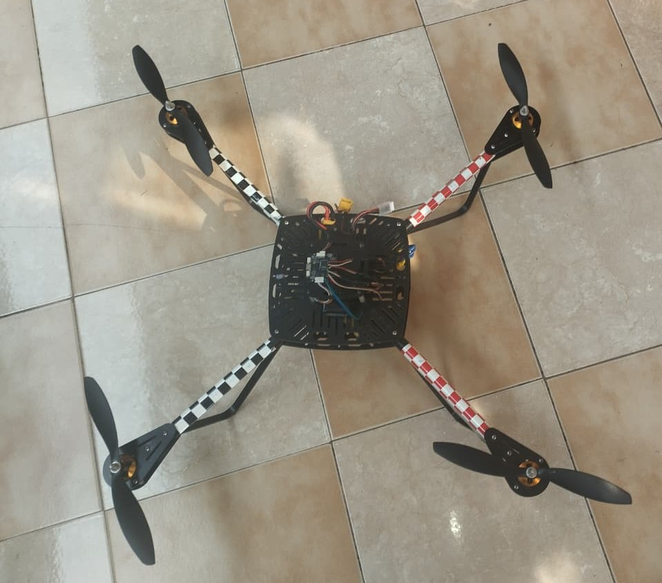
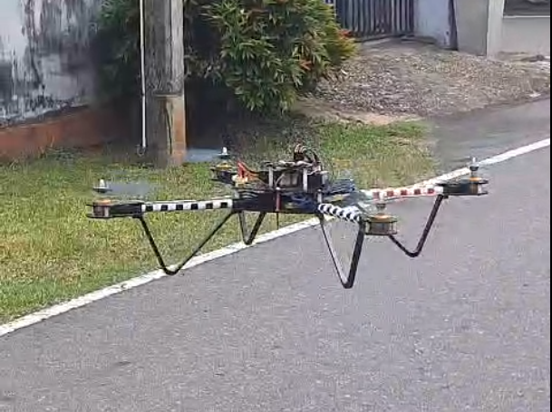

# 🛸 Quadcopter Drone Development

## 📌 Overview
This project involves the design and development of a quadcopter drone using a 4-motor (BLDC) propulsion system. The system focuses on stable flight control through PWM-based motor control, ESC calibration, and real-time tuning of control parameters.

The project demonstrates practical experience in embedded systems, robotics, and hardware integration.

---

## ⚙️ Hardware Components
- 4x BLDC Motors
- Electronic Speed Controllers (ESCs)
- 6-Channel RC Receiver
- Flight Frame (Quadcopter)
- Power Distribution Board / Battery
- Microcontroller (Arduino / similar)

---

## 🔧 System Architecture
The drone operates using PWM signals to control motor speeds via ESCs. Each motor contributes to controlling:

- **Throttle** → Lift control  
- **Pitch** → Forward/Backward tilt  
- **Roll** → Left/Right tilt  
- **Yaw** → Rotation  

The RC receiver provides input signals which are processed and translated into PWM outputs for precise motor control.

---

## 🧠 Key Features
- PWM-based motor control for flight dynamics  
- ESC calibration for synchronized motor response  
- Real-time tuning of control signals  
- Stable multi-motor coordination  
- Hardware-level debugging and signal optimization  

---

## 🛠️ Implementation Details
- Configured ESCs and tested motor response under varying PWM signals  
- Integrated RC receiver signals for manual control  
- Tuned control parameters to improve stability and responsiveness  
- Troubleshot issues such as signal noise, motor desynchronization, and arming failures  

---

## 📸 Project Images

> Add your images inside a folder named `images/`

---

## 🎥 Demo (Optional)
Add a video link if available:
